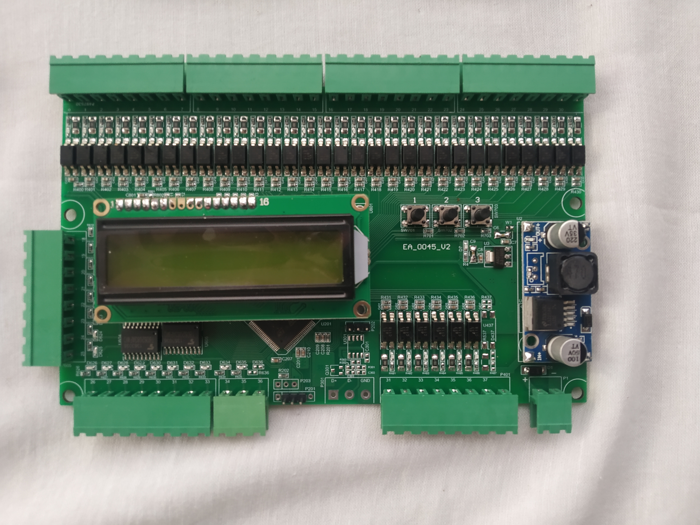


  
  
  
  


# Specification

* Supply Voltage : 12VDC / 24VDC
* No of Stop: Upto G+8 (9 Opening)
* Auto Door / Manual Door
* All Reed / Three Reed
* An error are display on LCD display
* All system parameters can be adjusted by using 3 buttons and LCD placed on the card
* Call Register LED and Call Push Button are on single wire
* All the Input and Output are available in both 12VDC and 24VDC
* All the Input and Output are carrying LED indication on board
* Each floor can be named by an alphanumeric character (L, C, P, b, t, G, 0, 1, 2, 3.....).
* All pin can be re-configure to any other pin on site
* UPS function
* Hydraulic lift support

---

# PARAMETER PROGRAMMING MODE

USING THIS MODE WE CAN SET VARIOUS PARAMETERS AND TIMERS WHICH ARE AFFECTING
NORMAL OPERATION OF LIFT. NORMALLY THESE ARE USEFUL AT THE TIME OF NEW INSTALLATION.

FOR ENTERING IN THIS MODE, LIFT SHOULD BE IN INSPECTION MODE, KEEP PRESSED 1 NO. BUTTON ON MOTHERBOARD AND POWER ON THE CONTROLLER.

LCD DISPLAY ***“SETTING MENU”*** WILL APPEAR

LEAVE THE BUTTON AND NOW THE CONTROLLER WILL ASK FOR PASSWORD.

USE ‘2’ NO. BUTTON TO INCREASE DECREASE VALUE AND ‘3’ NO BUTTON TO GO TO THE NEXT VALUE.
#### 1. NO OF FLOOR
INDICATES THE NUMBER OF FLOORS. Eg. G+?
#### 2. REED TYPE
INDICATES THE TYPE OF REED SYSTEM FOR FLOOR IDENTIFICATION. EITHER 3 REED/CARTOP OR
ALLREED/FLOOR REED.
#### 3. DOOR TYPE
SHOULD BE “AUTOMATIC DOOR” FOR AUTODOOR LIFT & “MANUAL DOOR” FOR MANUAL DOOR LIFT.
#### 4. CLEAR ON STOP
INDICATES WHETHER ALLPENDING CALLS SHOULD BE CLEARED OR NOT, ON PRESSING STOP BUTTON. IF WE SET “YES”, ALL CALL WILL BE CLEARED ON STOP.
#### 5. DOOR OPEN TIMEOUT
THIS IS THE MAXIMUM ALLOWABLE TIME THE DO OUTPUT WILL BE ON BEFORE GETTING THE DOL SIGNAL.
#### 6. DOOR HAULT TIME

#### 7. DOOR JAM TIME
THIS IS THE MAXIMUM ALLOWABLE TIME THE DOOR MOTOR WILL TRY TO CLOSE THE DOOR IF THE DOOR CANNOT GET CLOSED WITHIN THIS MUCH TIME.
#### 8. FAN OFF TIMEOUT
THIS INDICATES TIME FOR CABIN FAN CONTINUES TO BE ON AFTER HAULT TIMER STOPS. IF YOU SET HAULT TIMER= 2 SEC AND FAN TIME= 10 SEC, CABIN FAN WILL BE CUT OFF AFTER 12SEC.
####  9. FLOOR HAULT TIME
INDICATES STOPPAGE TIME OF LIFT ON A FLOOR, IF MULTIPLE CALLS ARE PRESENT AT A TIME.
#### 10. DOOR TO MOTOR TIME
THIS DEFINES THE TIME PERIOD BETWEEN DOOR CLOSED AND MAIN MOTOR STARTS.
#### 11. RAMP ON TIME
INDICATES TIME IN SEC FOR WHICH RAM BECOMES ON BEFORE GETTING LANDING INTERLOCK.
#### 12. RAMP OFF TIME
INDICATES TIME IT WILL CONTINUE ON AFTER MAIN MOTOR AND BRAKE STOPS.
#### 13. RAMP ON OFF NUMBER
TOTAL NUMBER OF TIMES THE RETURNING CAM STRIKES IF LANDING INTERLOCK IS MISSING.
#### 14. MOTOR TO DOOR TIME
THIS DEFINES TIME PERIOD BETWEEN MAIN MOTOR STOPPED AND DOOR MOTOR STARTS FOR
OPENING.
#### 15. DOOR LOCK CHECK
IF WE SET “YES”, CONTROLLER WILL NOT ALLOW BYPASS (JUMPER) CAR INTERLOCK AND LANDING INTERLOCK. THE CONTROLLER WILL STOP OPERATION
#### 16. FIRE FLOOR
FLOOR AT WHICH LIFT WILL GO AT THE TIME IN WHICH FIRE INPUT WILL BE ENABLED.
#### 17. V3F
YES/NO
YES=MAIN MOTOR V3F/2 SPEED MODE.
NO= MAIN MOTOR SINGLE SPEED MODE
#### 18. UPS FUNCTION
UPS BATTERY BACKUP SUPPORT ENABLE OR DISABLE.
YES= ENABLE
NO= DISABLE
#### 19. 3 PHASE ON TIME
#### 20. 1 PHASE ON TIME
#### 21. FULL COLLECTIVE
NOT SUPPORTED AT THIS TIME. WE SUPPORT DOWN COLLECTIVE ONLY.
#### 22. UFC
TO SELECT WHETHER UP DIRECTION LIMIT IS NORMALLY OPEN (NO) OR NORMALLY CLOSE (NC).
#### 23. DFC
TO SELECT WHETHER DOWN DIRECTION LIMIT IS NORMALLY OPEN (NO) OR NORMALLY CLOSE (NC).
#### 24. USL
TO SELECT WHETHER UP SLOW LIMIT IS NORMALLY OPEN (NO) OR NORMALLY CLOSE (NC).
#### 25. DSL
TO SELECT WHETHER DOWN SLOW LIMIT IS NORMALLY OPEN (NO) OR NORMALLY CLOSE (NC).
#### 26. INS
TO SELECT WHETHER INSPECTION INPUT IS NORMALLY OPEN (NO) OR NORMALLY CLOSE (NC).
#### 27. OP_SLOW
TO SELECT WHETHER THE SLOW OUTPUT IS NORMALLY OPEN (NO) OR NORMALLY CLOSE (NC).
#### 28. RE-LEVEL
REQUIRES IN HYDRAULIC LIFT TO RE-LEVEL THE ELEVATOR CAR DUE TO SLIPPAGE OF CAR FROM
LEVELLING POSITION.
#### 29. RE-LEVEL AUTO
YES=RE-LEVELLING FUNCTION WILL OCCOUR AUTOMATICALLY IF THE CAR SLIPS FROM THE
LEVELLING POSITION AT THE TIME OF HAULTING.

NO= RELEVELLING FUNCTION WILL OCCOUR ONLY IF THE RELEVELLING SIGNAL IS ACTIVATED.

***After successful programming, LCD display will show “PLEASE RESTART DEVICE”.***

POWER OFF THE CONTROLLER AND ON IT AFTER SOMETIME.

---

# DIPLAY SETTING OF FLOORS

TO GO TO DISPLAY SEETING OF FLOOR, KEEP PRESSED ‘3’ NO BUTTON AND POWER THE
CONTROLLER.

DISPLAY WILL SHOW ***“FLOOR NO DISPLAY SETTING”***.

FIND BELOW THE DECIMAL VALUE OF FLOOR SEETINGS. 
FOR EXAMPLE, IF YOU WANT TO CHANGE THE DISPLAY OF GROUND FLOOR FROM ‘0’ TO ‘B’.
YOU HAVE TO CHANGE THE GROUND FLOOR DISPLAY SETTING FROM 63 TO 124.

| FLOOR NO | DECIMAL VALUE |
| :------: | :-----------: |
|    0     |      63       |
|    1     |       6       |
|    2     |      91       |
|    3     |      79       |
|    4     |      102      |
|    5     |      109      |
|    6     |      125      |
|    7     |       7       |
|    8     |      127      |
|    9     |      111      |
|    B     |      124      |
|    U     |      62       |
|    T     |      120      |
|    P     |      115      |
|    G     |      61       |
|    H     |      118      |

---

# CARD COUNT PROGRAMMING MODE

TO GO TO CARE COUNT SETTING, KEEP PRESSED ‘2’ NO. BUTTON AND POWER ON THE CONTROLLER.

ENTER INTO THE CARE COUNT MODE, DISPLAY WILL SHOW “HOUR/LOCK”.

YOU CAN SET COUNT 1 HR TO 1500 HRS.

SET LOCK YES/NO?
- IF YOU WANT SET LOCK MAKE IT YES. ELSE SET IT NO.

AFTER COUNTING IS COMPLETE THE LIFT WILL STOP WORKING AND LCD WILL SHOW “ ERROR 402”.

---

# INPUT / OUTPUT PIN SETTING

BY USING THIS MODE, WE CAN SOLVE HARDWARE PROBLEM OF INPUTS AND OUTPUTS WITHOUT CHANGING ANY ELECTRONIC COMPONENT.

WE CAN CHANGE PIN NUMBER FOR A PARTICULAR SIGNAL.

BEFORE ENTERING IN TO THIS MODE, IT IS ADVISED TO DISCONNECT ALL MOTOR/DRIVE WIRE.

KEEP PRESSED ‘1’ & ‘2’ BUTTON AND POWER ON THE CONTROLLER UNTIL MESSAGE “INPUT/OUTPUT PIN SETTING” COMES ON LCD DISPLAY.

#### EXAMPLE
**4th FLOOR CAR CALL SIGNAL, PIN NO 4 IS NOT WORKING.**

**WE FOUND THAT PIN NO 6 IS UNCONNECTED/ VACANT.**

**WE WANT TO USE PIN NO 6 FOR 4TH FLOOR CAR CALL.**

**GO TO :**
- CABIN CALL 4 LED
- CHANGE 004 TO 006.

---

# CARD TEST

**TO GET INTO THIS MODE PRESS 2 & 3.**

--- 

**Document Version:** 1.0.0
